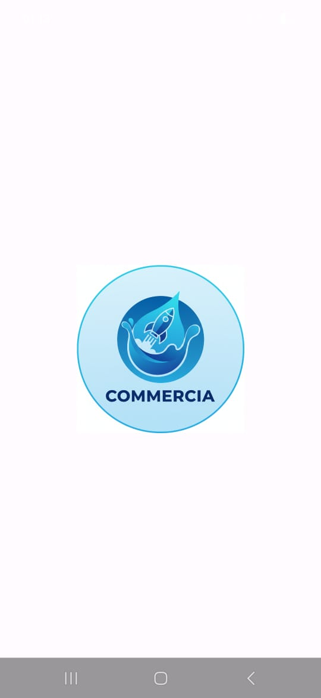
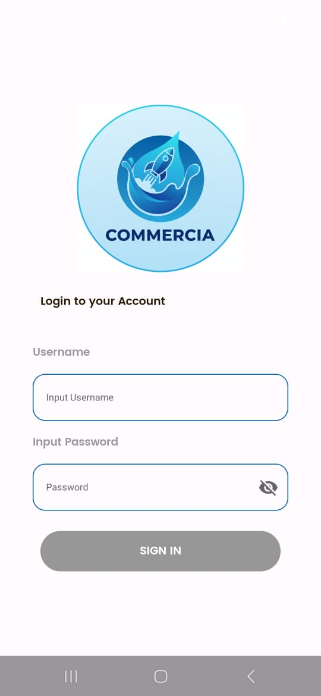
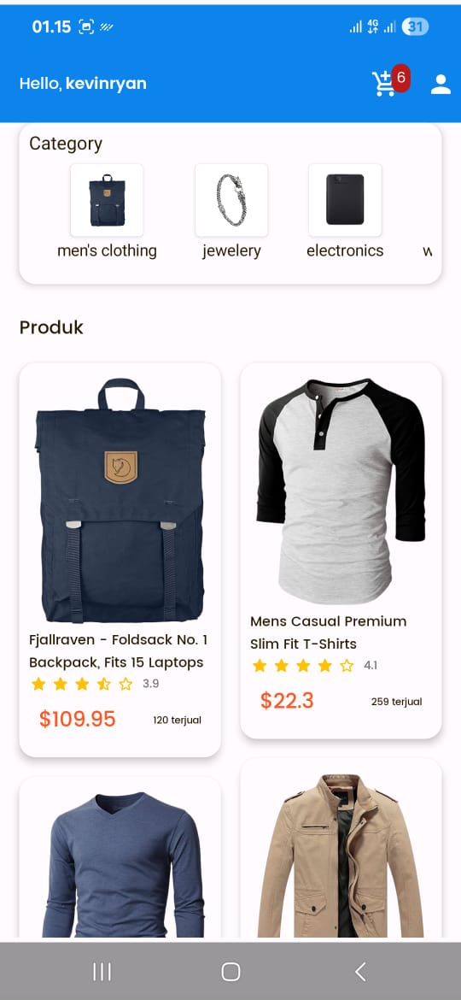
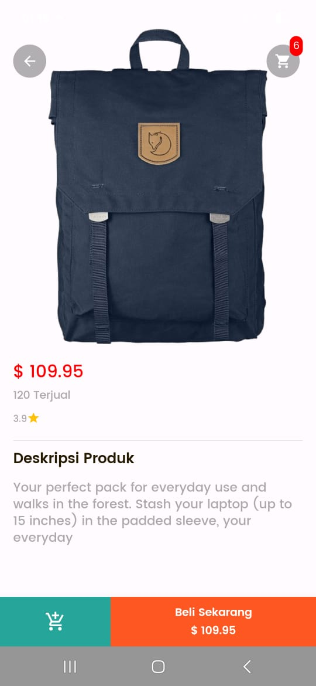
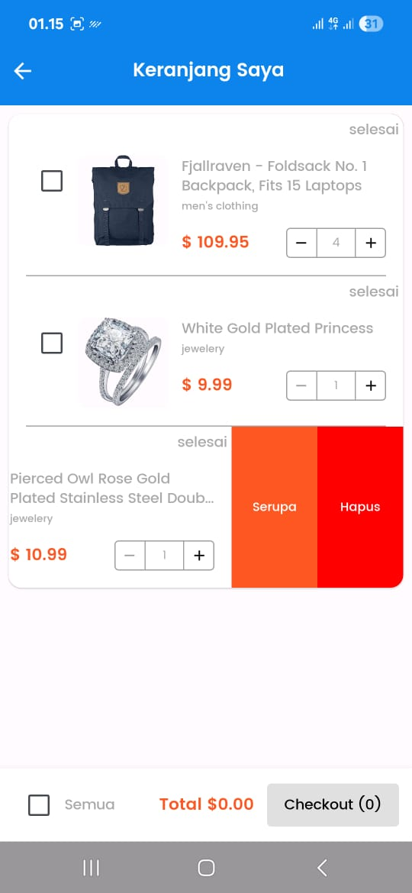
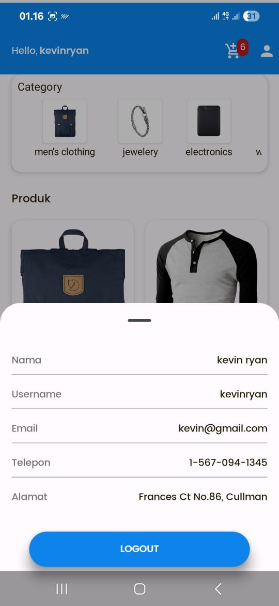

# Proyek Aplikasi E-Commerce

Aplikasi E-Commerce sederhana yang dibangun untuk platform Android menggunakan teknologi modern.

## Fitur Utama

- **Autentikasi Pengguna**: Sistem untuk login pengguna.
- **Penjelajahan Produk**: Menampilkan daftar produk, melihat detail produk, dan menyaring berdasarkan kategori.
- **Keranjang Belanja**: Pengguna dapat menambah, melihat, memperbarui, dan menghapus item dari keranjang belanja mereka.

## Tech Stack & Arsitektur

Proyek ini dibangun dengan mengikuti prinsip **Clean Architecture** untuk memastikan kode yang bersih, terstruktur, dan mudah dikelola. Pola yang digunakan adalah **MVVM (Model-View-ViewModel)**.

- **Bahasa**: [Kotlin](https://kotlinlang.org/)
- **UI Toolkit**: [Jetpack Compose](https://developer.android.com/jetpack/compose)
- **Arsitektur**: Clean Architecture
- **Asynchronous**: Kotlin Coroutines & Flow
- **Dependency Injection**: Hilt
- **Networking**: Retrofit2
- **Database Lokal**: Room
- **Navigasi**: Jetpack Navigation for Compose

## Struktur Paket

Struktur paket diatur berdasarkan lapisan arsitektur untuk memisahkan tanggung jawab (`separation of concerns`).

- `com.example.ecommerce`
  - `core`: Berisi kode inti yang digunakan di seluruh aplikasi.
    - `data`: Implementasi dari lapisan data.
      - `local`: Komponen database Room (DAO, Entity, Database).
      - `remote`: Komponen jaringan Retrofit (Models/DTO, Service API).
      - `repository`: Implementasi dari repository-interface yang didefinisikan di lapisan domain.
    - `di`: Modul Dependency Injection menggunakan Hilt.
  - `domain`: Lapisan domain (business logic) yang independen dari UI dan Data.
    - `model`: Objek/entitas bisnis utama (misalnya `Product`, `User`, `Cart`).
    - `usecase`: Berisi logika bisnis spesifik untuk setiap fungsionalitas (misalnya `LoginUseCase`, `AddCartUseCase`).
    - `mapper`: Bertugas memetakan model dari lapisan `data` ke model lapisan `domain`.
  - `libraries`: Berisi kelas-kelas dasar atau pembantu.
    - `base`: Kelas dasar untuk App, MVI, atau MVVM.
    - `network`: Utilitas untuk menangani state jaringan (misalnya `DataState`).
  - `view`: Lapisan presentasi (UI).
    - `screen`: Berisi Composable untuk setiap layar/halaman aplikasi.
    - `component`: Komponen UI yang dapat digunakan kembali (misalnya `Button`, `TextField`).
    - `navigation`: Konfigurasi dan pengaturan grafik navigasi aplikasi.
    - `theme`: Tema aplikasi (warna, font, bentuk).

## Screenshoot

Berikut adalah beberapa tangkapan layar dari aplikasi:

### Splash Screen

### Login Screen

### Home Screen

### Product Detail Screen

### Cart Screen

### Profile Screen

